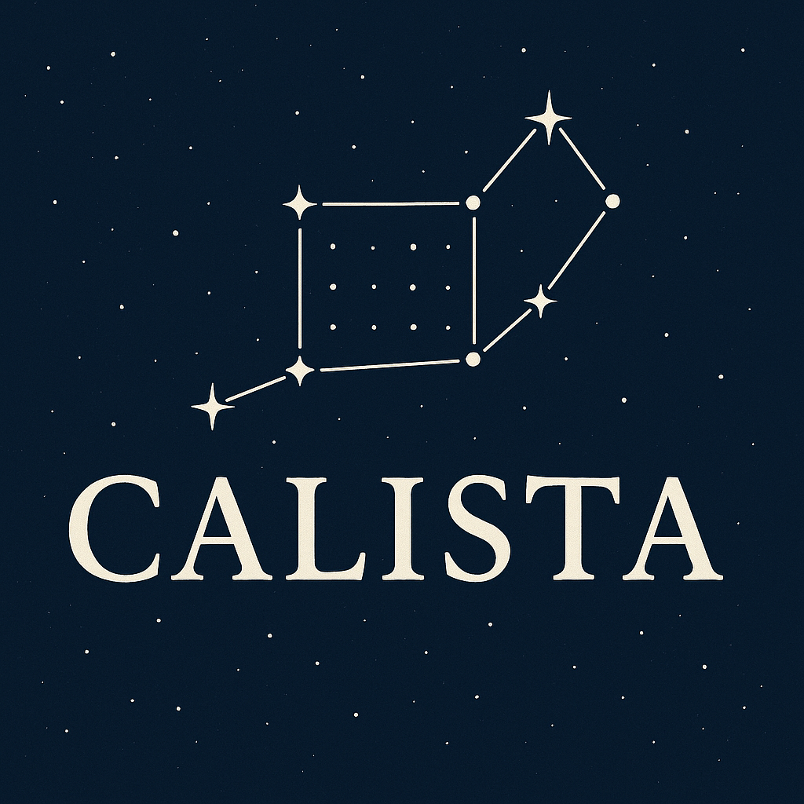

**C**CD **A**nalyis and **L**ogging **I**nfrastructure for **S**cientific **T**raceable **A**rchives

> A traceable pipeline for CCD photometry and spectroscopy

CALISTA is a Python-based pipeline for ingesting, processing, and analyzing astronomical CCD images.
It is designed for professional and amateur astronomers who need a reproducible, event-driven system for photometric measurements.

## 🚧 Work in Progress

This project is currently under active development. Features and structure are evolving rapidly, and things may break or change frequently.
Feel free to explore, but it is not yet ready for general use.

## Architecture

CALISTA uses an **event sourcing** and **CQRS-inspired** architecture:

1. **Adapters** – Handle the outside world (FITS readers, DB connectors, file storage).
2. **Core domain** – Defines images, calibrations, measurements, and events.
3. **Service layer** – Coordinates commands and events via a message bus.
4. **Database** – Stores both raw events and derived read models.

This makes CALISTA **auditable**, **reproducible**, and **extensible**.

## Documentation

- **Live site:** https://mhallum.github.io/calista
- **Build locally:** `poetry run mkdocs serve`

## License

This project is licensed under the [MIT License](LICENSE).
